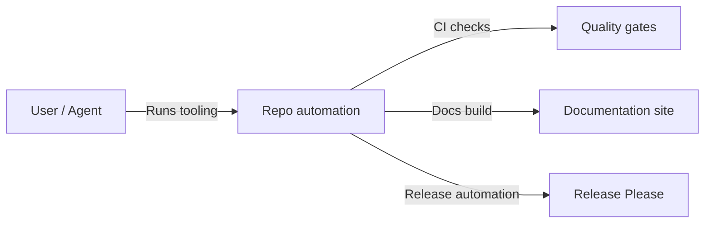

# Architecture & Service Flow

```mermaid
flowchart LR
    user[User / Agent] -->|Runs tooling| repo[Repo automation]
    repo -->|CI checks| checks[Quality gates]
    repo -->|Docs build| docs[Documentation site]
    repo -->|Release automation| release[Release Please]
```

## Overview

This sandbox repository focuses on code-quality automation, documentation
validation, and lightweight observability scaffolding for future services.
